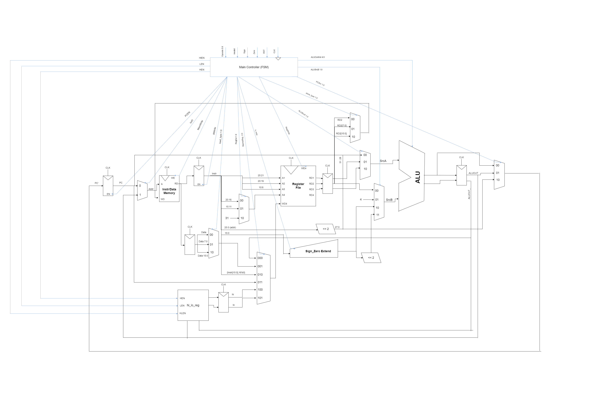
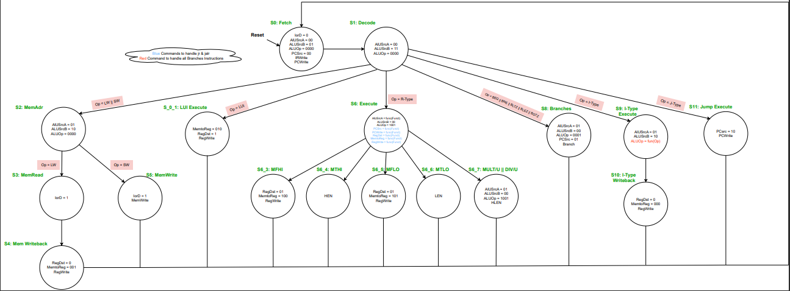
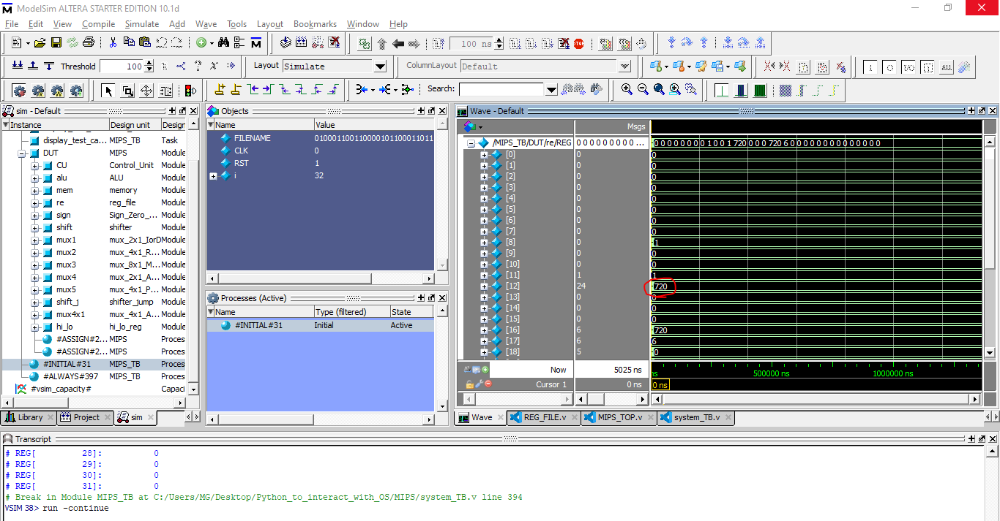
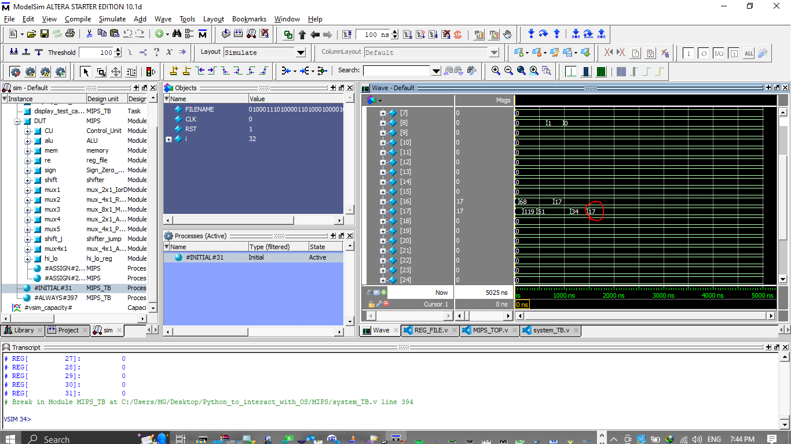

# _**Multicycle MIPS Processor**_
> ## _Project Description_
   * Design of a 32-bit **_Multicycle Micro-Architecture MIPS processor_** based on Von-Neumann architecture fully implemented RTL Verilog.
   * Supported Most of Instructions in the Appendix-B in **Digital Design and Computer Architecture** Reference. 

> ## _Contents_
   * _RTL files._
   * _Test Bench File to test the processor by using:_
        * [All Covered Instruction](Input_MEM.txt)
        * [Reference TB](programs_check.txt)
        * [Factorial Program](Factorial.txt)
        * [GCD Program](GCD.txt)

> ## _MIPS Modified Architecture_


> ## _FSM of Control Unit_



> ## _Result Figures_
The processor was tested on Modelsim using
* **All supported instructions**
* **Factorial program** (of the number `6`)
* **GCD of two numbers** (`68` & `119`).
1. All Covered Instruction [Test Result](All_Instructions_Test_Results.txt)

1. Factorial Program


2. GCD Program


> ## __Run your own Program__
* You only need to go to [MIPS_TOP_TB.v](MIPS_TOP_TB.v) File, and change parameter `FILENAME` to your machine code.
    ```verilog
    parameter FILENAME = "Input_MEM.txt";  
    ```

> ## __Resources__
* **Digital Design and Computer Architecture Reference** by David Harris & Sarah L. Harris. 


